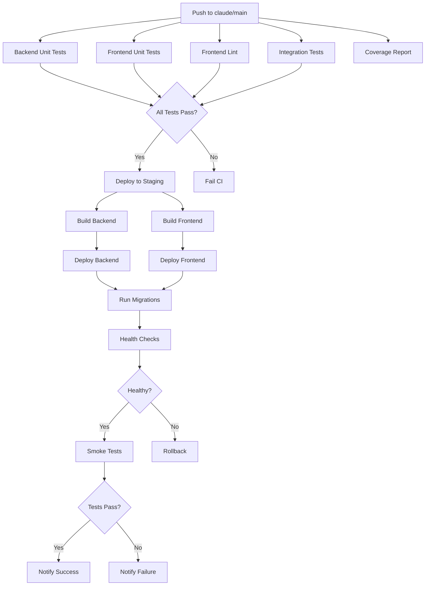

# GitHub Actions Workflows

Comprehensive CI/CD pipelines for the AI Meal Planner application.

## Overview

This directory contains GitHub Actions workflows for:
- Automated testing (unit, integration, E2E)
- Code quality enforcement (linting, type checking, coverage)
- Automated deployment (staging, production)
- Coverage reporting and tracking

## Workflows

### Testing Workflows

#### `backend-unit-tests.yml`

Runs Python unit tests for the backend application.

**Triggers:**
- Push to `claude/main`
- Pull requests to `claude/main`
- Manual dispatch

**Features:**
- Tests on Python 3.11 and 3.12
- Coverage reporting with 80% threshold
- Codecov integration
- Artifact upload (coverage reports)

**Duration:** ~5-10 minutes

#### `integration-tests.yml` 🆕

Runs comprehensive integration tests against real services.

**Triggers:**
- Push to `claude/main`
- Pull requests to `claude/main`
- Manual dispatch

**Services:**
- PostgreSQL 15 (test database)
- Redis 7 (event bus, rate limiting)

**Features:**
- Database migrations before tests
- Parallel execution (`pytest -n auto`)
- Coverage with 75% threshold
- Flakiness detection (retry failed tests)
- Test duration tracking
- PR comments on failure
- Correlation ID propagation tests

**Test categories:**
- Database operations (CRUD, transactions)
- Authentication flows (login, register, tokens, rate limiting)
- Recipe API (harvest, search, pagination)
- Meal plan generation (constraints, validation)
- Grocery cart aggregation (Knuspr integration)
- Workflow orchestration (multi-step operations)
- Error handling (400, 401, 403, 404, 500)
- Health checks (all endpoints)

**Duration:** ~20-30 minutes

#### `frontend-unit-tests.yml`

Runs Jest unit tests for the Next.js frontend.

**Triggers:**
- Push to `claude/main`
- Pull requests to `claude/main`
- Manual dispatch

**Features:**
- Tests on Node.js 20
- Coverage reporting
- Test result artifacts

**Duration:** ~5-10 minutes

#### `frontend-lint.yml`

Runs ESLint and type checking for the frontend.

**Triggers:**
- Push to `claude/main`
- Pull requests to `claude/main`
- Manual dispatch

**Features:**
- TypeScript type checking
- ESLint validation
- Prettier formatting check

**Duration:** ~3-5 minutes

#### `playwright.yml`

Runs Playwright E2E tests for the frontend.

**Triggers:**
- Push to `claude/main`
- Pull requests to `claude/main`
- Manual dispatch

**Features:**
- Tests across multiple browsers
- Screenshot capture on failure
- Video recording

**Duration:** ~10-15 minutes

### Coverage Workflows

#### `coverage-report.yml` 🆕

Comprehensive coverage tracking and enforcement across backend and frontend.

**Triggers:**
- Push to `claude/main`
- Pull requests to `claude/main`
- Manual dispatch

**Services:**
- PostgreSQL 15
- Redis 7

**Features:**

**Backend Coverage:**
- Runs all backend tests (unit + integration)
- Coverage threshold: 80%
- Codecov integration
- Coverage badge generation
- Per-file coverage breakdown
- Coverage diff for PRs (fails if decrease > 2%)

**Frontend Coverage:**
- Jest coverage with Istanbul
- Coverage threshold: 75%
- Codecov integration
- Coverage badge generation
- Coverage diff for PRs

**Aggregated Coverage:**
- Weighted average (60% backend, 40% frontend)
- Combined coverage report
- PR comments with coverage summary
- Badge updates on main branch

**Duration:** ~15-20 minutes

### Deployment Workflows

#### `deploy-staging.yml` 🆕

Automated deployment to staging environment on successful CI.

**Triggers:**
- Push to `claude/main` (after CI passes)
- Manual dispatch

**Environment:** `staging`

**Steps:**

1. **Wait for CI** - Ensures all tests pass before deployment
2. **Build Backend**
   - Docker image build and push to GHCR
   - Tagging: `latest`, `staging`, `sha-<commit>`
   - Layer caching for faster builds
3. **Build Frontend**
   - Next.js production build
   - Upload build artifacts
4. **Deploy Backend (Railway)**
   - Deploy to Railway staging environment
   - Run database migrations (`alembic upgrade head`)
   - Verify migration success
   - Health checks (wait up to 2 minutes)
   - Automatic rollback on failure
5. **Deploy Frontend (Vercel)**
   - Deploy to Vercel production slot
6. **Smoke Tests**
   - Run smoke test suite
   - Validate critical endpoints
   - Test database connectivity
   - Verify frontend accessibility
7. **Notifications**
   - Slack notification with status
   - GitHub deployment status
   - PR comment with deployment links

**Secrets Required:**
- `RAILWAY_TOKEN` - Railway API token
- `VERCEL_TOKEN` - Vercel deployment token
- `VERCEL_ORG_ID` - Vercel organization ID
- `VERCEL_PROJECT_ID` - Vercel project ID
- `STAGING_API_URL` - Staging backend URL
- `STAGING_BACKEND_URL` - Full backend URL
- `STAGING_FRONTEND_URL` - Staging frontend URL
- `SLACK_WEBHOOK_URL` - Slack webhook for notifications
- `CODECOV_TOKEN` - Codecov upload token

**Rollback:**
- Automatic rollback on health check failure
- Manual rollback trigger available
- Previous deployment always available

**Duration:** ~15-20 minutes

### Code Quality Workflows

#### `claude.yml`

Claude Code review workflow (existing).

#### `claude-code-review.yml`

Automated code review workflow (existing).

## Workflow Dependencies



## Environment Configuration

### Staging Environment

- **Backend:** Railway staging service
- **Frontend:** Vercel preview deployment
- **Database:** Railway PostgreSQL (staging)
- **Redis:** Railway Redis (staging)

### Production Environment

- **Backend:** Railway production service
- **Frontend:** Vercel production deployment
- **Database:** Railway PostgreSQL (production)
- **Redis:** Railway Redis (production)

## Running Workflows Locally

### Integration Tests

```bash
# Start services
docker-compose -f infrastructure/docker-compose.yml up -d postgres redis

# Run migrations
cd backend
alembic upgrade head

# Run integration tests
pytest tests/integration/ -v -m integration
```

### Smoke Tests

```bash
# Start local server
uvicorn app.main:app --reload

# In another terminal
export API_BASE_URL=http://localhost:8000
pytest tests/smoke/ -v -m smoke
```

### Coverage Report

```bash
# Backend
cd backend
pytest tests/ -v --cov=app --cov-report=html

# Frontend
cd frontend
npm test -- --coverage

# View reports
open backend/htmlcov/index.html  # Backend
open frontend/coverage/lcov-report/index.html  # Frontend
```

## Maintenance

### Adding New Workflows

1. Create workflow file in `.github/workflows/`
2. Define triggers and jobs
3. Add required secrets to GitHub repository settings
4. Test with `act` (local GitHub Actions runner) if possible
5. Update this README with workflow documentation

### Updating Thresholds

Coverage thresholds are defined in:
- Backend: `pytest.ini` and `coverage-report.yml`
- Frontend: `jest.config.js` and `coverage-report.yml`

Rate limiting thresholds:
- Backend: `backend/app/utils/rate_limit.py`

### Workflow Optimization

Current optimization strategies:
- **Caching:** pip, npm, Docker layers
- **Parallelization:** pytest-xdist, matrix builds
- **Conditional execution:** Path-based triggers
- **Artifact reuse:** Build once, deploy multiple

### Troubleshooting

**Tests failing in CI but passing locally:**
- Check environment variables
- Verify service versions match (PostgreSQL, Redis)
- Check for timing issues (increase timeouts)
- Review pytest markers

**Deployment failures:**
- Check Railway/Vercel status pages
- Verify secrets are set correctly
- Review service logs in Railway dashboard
- Check health endpoint responses

**Coverage drops unexpectedly:**
- Review PR diff for uncovered code
- Check if new files are excluded
- Verify tests are being discovered
- Run coverage locally to debug

## Metrics and Monitoring

### Test Duration Tracking

Integration tests track duration metrics:
- Total test count
- Total execution time
- Failure/error count
- Success rate percentage

View in GitHub Actions run summary.

### Coverage Trends

Coverage trends tracked over time:
- Per-commit coverage percentage
- Coverage diff in PRs
- Historical trends (weekly/monthly)

View in Codecov dashboard.

### Deployment Success Rate

Track deployment metrics:
- Deployment frequency
- Success/failure rate
- Rollback frequency
- Average deployment duration

View in Railway analytics.

## Best Practices

1. **Keep workflows fast** - Target < 30 minutes total CI time
2. **Use caching** - Cache dependencies and build artifacts
3. **Fail fast** - Run quick checks (linting) before slow ones (E2E)
4. **Parallelize** - Use matrix builds and parallel test execution
5. **Monitor costs** - Track GitHub Actions minutes usage
6. **Document changes** - Update this README when modifying workflows
7. **Test locally** - Use `act` to test workflows before pushing
8. **Version dependencies** - Pin action versions for reproducibility

## Future Enhancements

- [ ] Add production deployment workflow
- [ ] Implement canary deployments
- [ ] Add performance regression testing
- [ ] Implement automated security scanning
- [ ] Add database backup verification
- [ ] Create workflow for dependency updates
- [ ] Add Lighthouse performance audits
- [ ] Implement feature flag management
