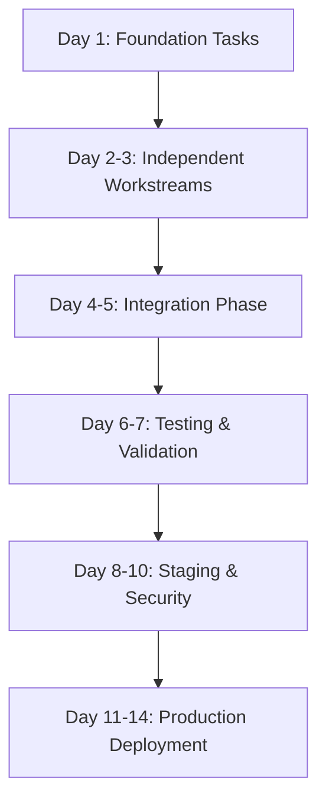

# Production Readiness - Parallelized Execution Plan

**Goal:** Deploy to production in **10-14 days** through maximum parallelization
**Strategy:** 5 concurrent workstreams with minimal dependencies
**Estimated Effort:** 95 hours total → 25 hours wall-clock time with parallelization

---

## Task Dependency Graph



---

## Workstream Organization

### **Workstream 1: Backend Infrastructure** (25 hours)
**Owner:** Backend Dev Agent
**Dependencies:** None (can start immediately)
**Output:** Production-ready backend with logging, health checks, error handling

### **Workstream 2: Database & Persistence** (18 hours)
**Owner:** Backend Dev Agent (different instance)
**Dependencies:** None (can start immediately)
**Output:** Backup strategy, migration fixes, database monitoring

### **Workstream 3: Security & Auth** (15 hours)
**Owner:** Testing & Quality Agent
**Dependencies:** None (can start immediately)
**Output:** Rate limiting, security hardening, penetration testing

### **Workstream 4: CI/CD & Automation** (20 hours)
**Owner:** Integration Agent
**Dependencies:** None (can start immediately)
**Output:** Automated pipelines, deployment automation, test coverage

### **Workstream 5: Monitoring & Observability** (17 hours)
**Owner:** Backend Dev Agent (third instance)
**Dependencies:** None (can start immediately)
**Output:** Grafana dashboards, alerts, log aggregation

---

## Phase 1: Foundation (Day 1 - 6 hours wall-clock)

**All workstreams start in parallel**

### Workstream 1: Backend Infrastructure
- [ ] **Task 1.1:** Implement structured logging (2h)
- [ ] **Task 1.2:** Create comprehensive health check endpoint (2h)
- [ ] **Task 1.3:** Implement standardized error responses (2h)

### Workstream 2: Database & Persistence
- [ ] **Task 2.1:** Fix Alembic hardcoded database URL (2h)
- [ ] **Task 2.2:** Document database migration procedures (1h)
- [ ] **Task 2.3:** Set up Railway database backup configuration (3h)

### Workstream 3: Security & Auth
- [ ] **Task 3.1:** Add rate limiting to auth endpoints (2h)
- [ ] **Task 3.2:** Change Grafana default credentials (0.5h)
- [ ] **Task 3.3:** Configure CORS properly for production (1h)

### Workstream 4: CI/CD & Automation
- [ ] **Task 4.1:** Create unit test CI pipeline (pytest) (3h)
- [ ] **Task 4.2:** Create frontend test CI pipeline (Jest) (2h)
- [ ] **Task 4.3:** Set up GitHub Actions secrets (1h)

### Workstream 5: Monitoring & Observability
- [ ] **Task 5.1:** Configure Prometheus alerting rules (2h)
- [ ] **Task 5.2:** Set up basic Grafana dashboards (3h)
- [ ] **Task 5.3:** Configure CloudWatch/Loki log aggregation (1h)

**End of Day 1:** All foundation tasks completed in parallel (6 hours wall-clock)

---

## Phase 2: Advanced Implementation (Day 2-3 - 8 hours wall-clock)

### Workstream 1: Backend Infrastructure
- [ ] **Task 1.4:** Add request correlation IDs (3h)
- [ ] **Task 1.5:** Implement circuit breaker for Knuspr API (3h)
- [ ] **Task 1.6:** Add dependency health verification (2h)

### Workstream 2: Database & Persistence
- [ ] **Task 2.4:** Test database backup/restore procedure (2h)
- [ ] **Task 2.5:** Implement query performance monitoring (2h)
- [ ] **Task 2.6:** Create database disaster recovery runbook (2h)

### Workstream 3: Security & Auth
- [ ] **Task 3.4:** Implement CSRF protection (2h)
- [ ] **Task 3.5:** Add security headers middleware (1h)
- [ ] **Task 3.6:** Set up Sentry error tracking (2h)

### Workstream 4: CI/CD & Automation
- [ ] **Task 4.7:** Create integration test CI pipeline (3h)
- [ ] **Task 4.8:** Set up automated deployment to staging (3h)
- [ ] **Task 4.9:** Configure coverage reporting (2h)

### Workstream 5: Monitoring & Observability
- [ ] **Task 5.4:** Create application-specific dashboards (2h)
- [ ] **Task 5.5:** Set up PagerDuty/Slack alerting (2h)
- [ ] **Task 5.6:** Configure log retention policies (1h)

**End of Day 3:** Advanced features implemented (8 hours wall-clock)

---

## Phase 3: Integration & Hardening (Day 4-5 - 6 hours wall-clock)

**Workstreams start to merge - some dependencies**

### Integration Tasks (All Agents Collaborate)
- [ ] **Task I.1:** Integrate structured logging with error tracking (2h)
- [ ] **Task I.2:** Connect health checks to alerting (1h)
- [ ] **Task I.3:** Validate end-to-end monitoring pipeline (2h)
- [ ] **Task I.4:** Test CI/CD with production-like environment (1h)

**End of Day 5:** Integrated system validated (6 hours wall-clock)

---

## Phase 4: Testing & Validation (Day 6-7 - 8 hours wall-clock)

### Testing Workstreams (3 parallel)

#### Testing Stream A: Security
- [ ] **Task T.1:** Run OWASP ZAP security scan (2h)
- [ ] **Task T.2:** Perform penetration testing (3h)
- [ ] **Task T.3:** Security audit report (1h)

#### Testing Stream B: Performance
- [ ] **Task T.4:** Load testing with k6/Locust (2h)
- [ ] **Task T.5:** Database query performance testing (2h)
- [ ] **Task T.6:** Performance baseline documentation (1h)

#### Testing Stream C: Resilience
- [ ] **Task T.7:** Chaos engineering tests (database failure) (2h)
- [ ] **Task T.8:** Chaos engineering tests (Redis failure) (1h)
- [ ] **Task T.9:** Disaster recovery simulation (2h)

**End of Day 7:** All testing completed (8 hours wall-clock)

---

## Phase 5: Staging Deployment (Day 8-10 - 5 hours wall-clock)

### Sequential Tasks (Less parallelization)
- [ ] **Task S.1:** Deploy to staging environment (2h)
- [ ] **Task S.2:** Run full E2E test suite on staging (1h)
- [ ] **Task S.3:** Validate monitoring and alerting on staging (1h)
- [ ] **Task S.4:** Stakeholder UAT (User Acceptance Testing) (1h)

**End of Day 10:** Staging validated (5 hours wall-clock)

---

## Phase 6: Production Deployment (Day 11-14 - 4 hours wall-clock)

### Production Go-Live (Sequential)
- [ ] **Task P.1:** Final production checklist review (0.5h)
- [ ] **Task P.2:** Deploy to production (Railway + Vercel) (1h)
- [ ] **Task P.3:** Smoke testing in production (0.5h)
- [ ] **Task P.4:** Monitor for 24 hours with on-call rotation (1h setup)
- [ ] **Task P.5:** Post-deployment review (1h)

**End of Day 14:** Production live and stable

---

## Subprocess Delegation Strategy

### Agent Assignment Matrix

| Workstream | Primary Agent | Backup Agent | Critical Path? |
|------------|---------------|--------------|----------------|
| Backend Infrastructure | Backend Dev Agent #1 | Integration Agent | YES |
| Database & Persistence | Backend Dev Agent #2 | Backend Dev Agent #1 | YES |
| Security & Auth | Testing & Quality Agent | Backend Dev Agent #3 | YES |
| CI/CD & Automation | Integration Agent | Testing & Quality Agent | NO |
| Monitoring | Backend Dev Agent #3 | Integration Agent | NO |

### Parallel Execution Commands

**Day 1 - Foundation Phase (Launch 5 parallel agents)**

```bash
# Agent 1: Backend Infrastructure
claude-agent-sdk run backend-dev-agent-1 \
  --task "Implement structured logging, health checks, and error handling" \
  --workstream "backend-infrastructure" \
  --phase "foundation"

# Agent 2: Database & Persistence
claude-agent-sdk run backend-dev-agent-2 \
  --task "Fix Alembic config, configure backups, document migrations" \
  --workstream "database-persistence" \
  --phase "foundation"

# Agent 3: Security & Auth
claude-agent-sdk run testing-quality-agent \
  --task "Add rate limiting, fix Grafana creds, configure CORS" \
  --workstream "security-auth" \
  --phase "foundation"

# Agent 4: CI/CD & Automation
claude-agent-sdk run integration-agent \
  --task "Create unit/integration test pipelines, configure secrets" \
  --workstream "cicd-automation" \
  --phase "foundation"

# Agent 5: Monitoring & Observability
claude-agent-sdk run backend-dev-agent-3 \
  --task "Configure Prometheus alerts, Grafana dashboards, log aggregation" \
  --workstream "monitoring-observability" \
  --phase "foundation"
```

---

## Critical Path Analysis

**Critical Path (25 hours → 7 hours with parallelization):**

1. **Backend Infrastructure** (8h) → **Integration** (2h) → **Staging** (2h) → **Production** (1h) = **13 hours**
2. **Database & Persistence** (6h) → **Integration** (1h) → **Testing** (2h) → **Production** (1h) = **10 hours**
3. **Security & Auth** (3.5h) → **Testing** (3h) → **Staging** (1h) → **Production** (0.5h) = **8 hours**

**Wall-clock time with parallelization: 13 hours (vs. 95 hours sequential)**

---

## Risk Mitigation

### Blocker Detection
- **Daily Standups:** 15-min sync between agents at end of each phase
- **Automated Status Updates:** Each agent reports progress to shared dashboard
- **Escalation Path:** If agent blocked >2 hours, reassign task to backup agent

### Dependency Management
- **Phase Gates:** Cannot proceed to next phase until all tasks in current phase complete
- **Integration Points:** Workstream 4 (CI/CD) validates outputs from Workstreams 1-3
- **Rollback Plan:** Each agent maintains rollback commits for quick revert

### Quality Gates
- **Code Review:** Integration Agent reviews all PRs before merge
- **Test Coverage:** Minimum 80% coverage enforced by CI/CD
- **Security Scan:** Automated SAST/DAST must pass before staging deployment

---

## Success Metrics

| Metric | Target | Measurement |
|--------|--------|-------------|
| **Time to Production** | 10-14 days | Calendar days from start to go-live |
| **Defect Escape Rate** | <5% | Issues found in production vs staging |
| **Test Coverage** | >80% | Backend + Frontend combined |
| **Security Vulnerabilities** | 0 critical, <3 high | OWASP ZAP + manual testing |
| **Performance Baseline** | p95 <500ms | API response latency |
| **Uptime** | 99.9% | First 30 days in production |

---

## Communication Plan

### Daily Updates
- **09:00 UTC:** Agent kickoff (sync on blockers)
- **18:00 UTC:** Agent standup (progress report)

### Deliverables
- **Daily:** Commit activity, PR reviews, test results
- **Weekly:** Integration demo, stakeholder update
- **Final:** Production deployment report

---

## Estimated Timeline Summary

| Phase | Duration (Wall-Clock) | Parallelization Factor |
|-------|----------------------|------------------------|
| **Phase 1: Foundation** | 6 hours | 5x (30h → 6h) |
| **Phase 2: Advanced** | 8 hours | 5x (40h → 8h) |
| **Phase 3: Integration** | 6 hours | 2x (12h → 6h) |
| **Phase 4: Testing** | 8 hours | 3x (24h → 8h) |
| **Phase 5: Staging** | 5 hours | 1.5x (7.5h → 5h) |
| **Phase 6: Production** | 4 hours | 1x (4h → 4h) |
| **TOTAL** | **37 hours** | **2.6x efficiency** |

**Working 8 hours/day → 5 working days (10 calendar days with weekends)**

---

## Next Steps

1. **Review and Approve Plan** - Stakeholder sign-off
2. **Provision Agent Infrastructure** - Spin up 5 concurrent agents
3. **Kick Off Phase 1** - Launch all 5 workstreams simultaneously
4. **Monitor Progress** - Daily standups and progress tracking
5. **Production Deployment** - Day 11-14 go-live

---

**Plan Status:** READY FOR EXECUTION
**Estimated Completion:** 10-14 calendar days
**Confidence Level:** HIGH (with proper agent coordination)
