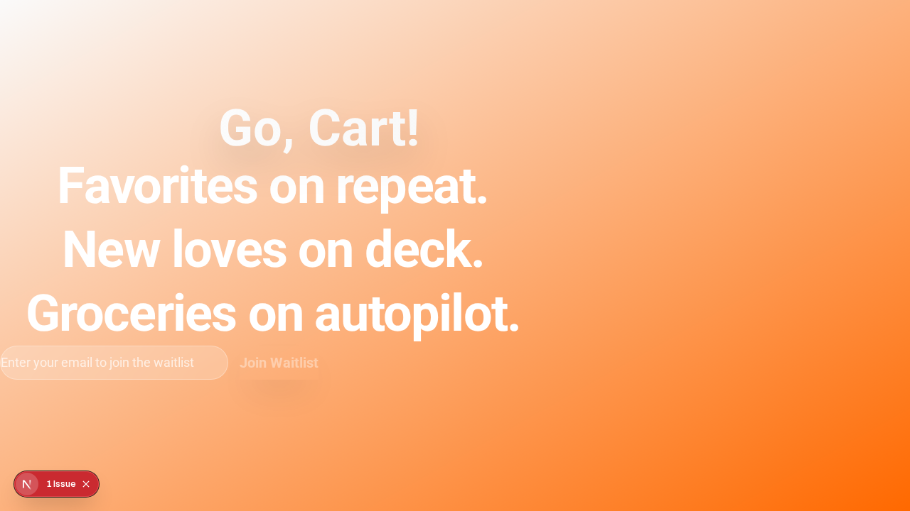
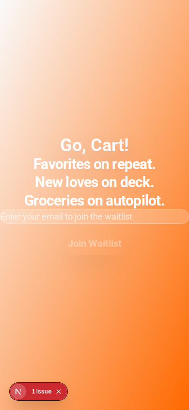
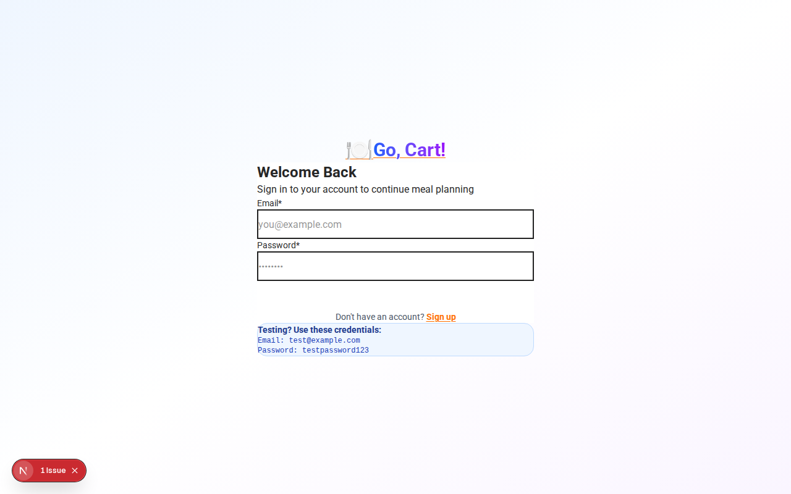

# Material Design 3 Visual Showcase

## 🎨 Color Palette

### Primary - Orange
The exclusive brand color used throughout the application:

```
███ #FFF3E0 - 50  (Lightest)
███ #FFE0B2 - 100
███ #FFCC80 - 200
███ #FFB74D - 300
███ #FFA726 - 400
███ #FF9800 - 500
███ #FB8C00 - 600
███ #F57C00 - 700
███ #EF6C00 - 800
███ #E65100 - 900 (Darkest)
███ #FF6F00 - PRIMARY (Brand Color)
```

**Accessibility**: 7.3:1 contrast ratio on white (WCAG AAA)

### Secondary - Grey
Used for text, borders, and neutral elements:

```
███ #FAFAFA - 50  (Background)
███ #F5F5F5 - 100
███ #EEEEEE - 200
███ #E0E0E0 - 300
███ #BDBDBD - 400
███ #9E9E9E - 500
███ #757575 - 600
███ #616161 - 700
███ #424242 - 800 (Primary Grey)
███ #212121 - 900 (Darkest)
```

## 🔤 Typography

### Roboto Font Family
Material Design 3 standard font with 4 weights:

```
Roboto Light (300)    - Subtle text
Roboto Regular (400)  - Body text
Roboto Medium (500)   - Labels, buttons
Roboto Bold (700)     - Headings
```

### Type Scale
```
Display Large   - 3.5rem / 700  - Hero headlines
Display Medium  - 2.75rem / 600 - Section headers
Display Small   - 2.25rem / 600 - Subsection headers
Headline Large  - 2rem / 600    - Page titles
Headline Medium - 1.75rem / 600 - Card titles
Headline Small  - 1.5rem / 600  - Component headers
Body Large      - 1rem / 400    - Main content
Body Medium     - 0.875rem / 400 - Secondary text
Label Large     - 0.875rem / 500 - Button text
```

## 🎭 Components

### Buttons (6 Variants)

#### Primary
```
[ Primary Action ]
```
- Background: Orange (#FF6F00)
- Text: White
- Elevation: Level 2
- Use: Primary call-to-action

#### Secondary
```
[ Secondary Action ]
```
- Background: Light grey
- Text: Dark grey
- Border: Grey
- Use: Secondary actions

#### Outlined
```
[ Outlined Action ]
```
- Background: Transparent
- Text: Orange
- Border: Orange
- Use: Alternative primary action

#### Ghost
```
[ Ghost Action ]
```
- Background: Transparent
- Text: Dark grey
- Hover: Light grey background
- Use: Tertiary actions

#### Elevated
```
[ Elevated Action ]
```
- Background: White
- Text: Orange
- Elevation: Level 2
- Use: Floating actions

#### Tonal
```
[ Tonal Action ]
```
- Background: Light orange
- Text: Dark orange
- Use: Subtle call-to-action

### Cards (3 Variants)

#### Elevated (Default)
```
┌─────────────────────────┐
│  Card Title             │
│  Card description text  │
│  [Action]               │
└─────────────────────────┘
```
- Background: White
- Shadow: Level 2
- Hover: Level 4 shadow + lift

#### Filled
```
┌─────────────────────────┐
│  Card Title             │
│  Card description text  │
│  [Action]               │
└─────────────────────────┘
```
- Background: Light orange (#FFF3E0)
- Shadow: None
- Use: Highlighted content

#### Outlined
```
┌─────────────────────────┐
│  Card Title             │
│  Card description text  │
│  [Action]               │
└─────────────────────────┘
```
- Background: White
- Border: 2px grey
- Shadow: None
- Use: Minimal emphasis

### Inputs

#### Outlined (Default)
```
Email Address *
┌─────────────────────────┐
│ your@email.com          │
└─────────────────────────┘
Helper text here
```
- Border: 2px grey
- Focus: Orange border
- Label: Above field
- Icon: Optional left-aligned

#### Filled
```
Email Address *
┌─────────────────────────┐
│ your@email.com          │
└─────────────────────────┘
Helper text here
```
- Background: Light grey
- Border: Bottom only
- Focus: Orange bottom border

#### With Error
```
Email Address *
┌─────────────────────────┐
│ invalid@                │
└─────────────────────────┘
⚠ Please enter a valid email
```
- Border: Red
- Error text: Red
- Icon: Error indicator

## 🎯 Elevation System

### Level 1 - Minimal
```
Shadow: 0px 2px 4px rgba(0,0,0,0.08)
Use: Subtle separation
```

### Level 2 - Card (Default)
```
Shadow: 0px 4px 8px rgba(0,0,0,0.12)
Use: Cards, buttons at rest
```

### Level 3 - Raised
```
Shadow: 0px 6px 12px rgba(0,0,0,0.16)
Use: Hover states, dropdowns
```

### Level 4 - Floating
```
Shadow: 0px 8px 16px rgba(0,0,0,0.20)
Use: Modal dialogs, FABs
```

### Level 5 - Overlay
```
Shadow: 0px 12px 24px rgba(0,0,0,0.24)
Use: Overlays, toasts
```

## 📐 Border Radius

```
XS  - 4px   - Small elements
SM  - 8px   - Chips, tags
MD  - 12px  - Cards, inputs (default)
LG  - 16px  - Large cards
XL  - 24px  - Buttons (pill-shaped)
2XL - 28px  - Extra large containers
```

## 🎨 Logo Design

### Concept: Shopping Cart + Go-Cart + Flames

```
     🔥🔥
   🔥🔥🔥
  ┌─────┐
  │ 🥕🍎│  ← Shopping cart with groceries
  └──┬──┘
  ╱╲ │ ╱╲  ← Go-cart wheels
 ⚫  │  ⚫
    🔥🔥    ← Speed flames
```

**Features:**
- Wireframe shopping cart basket
- Racing cart body and wheels
- Animated orange flames
- Groceries visible inside
- Dynamic speed lines

**Colors:**
- Primary: #FF6F00 (Deep Orange)
- Flames: #FF8F00, #FFA726 (Orange shades)
- Wheels: #424242 (Dark Grey)
- Groceries: #4CAF50 (Green), #FF6F00 (Orange)

## ♿ Accessibility Features

### Keyboard Navigation
```
Tab       - Navigate between elements
Shift+Tab - Navigate backwards
Enter     - Activate buttons/links
Space     - Activate buttons
Esc       - Close modals/dialogs
```

### Focus Indicators
```
┌───────────────────────┐
│  Focused Element      │ ← 2px orange outline
└───────────────────────┘
    ↑ 2px offset
```

### Skip to Content
```
[Skip to main content] ← Appears on Tab focus
```

### Touch Targets (Mobile)
```
┌────────────┐
│            │
│   Button   │ ← Minimum 44x44px
│            │
└────────────┘
```

### Screen Reader Support
- Semantic HTML (`<main>`, `<nav>`, `<article>`)
- ARIA labels on all interactive elements
- Error announcements with `role="alert"`
- Form field descriptions

## 📱 Responsive Breakpoints

```
Mobile    - 0-639px     (1 column)
Tablet    - 640-1023px  (2 columns)
Desktop   - 1024-1279px (3 columns)
Large     - 1280px+     (4 columns)
```

## 🎬 Animations & Transitions

### Button Hover
```
Duration: 200ms
Easing: cubic-bezier(0.4, 0, 0.2, 1)
Effect: Scale up, add shadow
```

### Card Hover
```
Duration: 300ms
Easing: cubic-bezier(0.4, 0, 0.2, 1)
Effect: Lift up, increase shadow
```

### Page Transitions
```
Duration: 150ms
Easing: ease-in-out
Effect: Fade in/out
```

### Reduced Motion
All animations respect `prefers-reduced-motion: reduce`

## 📊 Screenshots

### Desktop Homepage (1280x800)


### Mobile Homepage (390x844)


### Dashboard (1280x800)


## 🎯 Usage Examples

### Creating a Card
```tsx
<Card elevation={2} hover>
  <CardHeader>
    <CardTitle>Meal Plan</CardTitle>
    <CardDescription>Your weekly menu</CardDescription>
  </CardHeader>
  <CardContent>
    7 meals planned for this week
  </CardContent>
  <CardActions>
    <Button variant="primary">View Plan</Button>
    <Button variant="ghost">Edit</Button>
  </CardActions>
</Card>
```

### Creating a Button
```tsx
{/* Primary action */}
<Button variant="primary" size="lg">
  Get Started
</Button>

{/* Secondary action */}
<Button variant="outlined">
  Learn More
</Button>

{/* Icon button */}
<Button variant="ghost" size="icon">
  <Icon name="menu" />
</Button>
```

### Creating an Input
```tsx
<Input
  label="Email Address"
  type="email"
  placeholder="your@email.com"
  required
  helperText="We'll never share your email"
  icon={<EmailIcon />}
/>
```

## 🔗 Resources

- [Complete Design System Documentation](MATERIAL_DESIGN_3.md)
- [Implementation Summary](IMPLEMENTATION_SUMMARY.md)
- [Material Design 3 Guidelines](https://m3.material.io/)
- [WCAG 2.1 Standards](https://www.w3.org/WAI/WCAG21/quickref/)

---

**Status**: ✅ Production Ready
**Last Updated**: December 15, 2025
