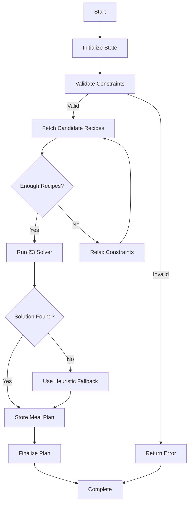

# Phase 2C: LangGraph Orchestration Implementation Plan

**Date**: 2025-11-17
**Branch**: `claude/phase-2c-langgraph-orchestration-<session_id>`
**Estimated Time**: 5-7 days
**Status**: 📋 Planning

---

## 🎯 Executive Summary

Upgrade the Meal Architect Agent with **LangGraph orchestration** to provide:
- **State Management**: Track workflow progression through each step
- **Conditional Routing**: Smart fallbacks when constraints can't be satisfied
- **Error Recovery**: Retry logic and graceful degradation
- **Observability**: LangSmith tracing for debugging
- **Visualization**: Mermaid diagrams of workflow execution

---

## 📊 Current State Analysis

### Existing Flow (Phase 2A)

```
generate_meal_plan()
  ├─ 1. Create meal_plan (status="generating")
  ├─ 2. Get candidate recipes
  ├─ 3. Run Z3 solver optimization
  ├─ 4. Store meal_plan_recipes
  └─ 5. Update status to "ready"
```

**Limitations**:
- ❌ No visibility into workflow progress
- ❌ Hard to debug when Z3 solver fails
- ❌ No intermediate states (all-or-nothing)
- ❌ Can't resume from failure point
- ❌ Limited error recovery strategies

### Target State (Phase 2C)



**Benefits**:
- ✅ Clear workflow visualization
- ✅ Intermediate state tracking
- ✅ Multiple fallback strategies
- ✅ Resume from failure point
- ✅ Rich debugging information

---

## 🏗️ Architecture

### LangGraph Workflow State

```python
from typing import TypedDict, Optional, List, Dict, Any
from datetime import date

class MealPlanningState(TypedDict):
    """State that flows through the LangGraph workflow."""

    # Input parameters
    user_id: int
    start_date: date
    num_days: int
    num_people: int
    dietary_restrictions: Optional[List[str]]
    excluded_ingredients: Optional[List[str]]
    target_calories_per_day: Optional[int]
    target_budget: Optional[float]
    preferred_cuisines: Optional[List[str]]
    meals_per_day: int

    # Workflow state
    meal_plan_id: Optional[int]
    current_step: str
    errors: List[str]
    warnings: List[str]
    retry_count: int

    # Intermediate results
    candidate_recipes: Optional[List[Dict[str, Any]]]
    constraints_relaxed: bool
    solver_result: Optional[Dict[str, Any]]
    fallback_used: bool

    # Final output
    meal_plan: Optional[Dict[str, Any]]
    generation_time_ms: Optional[int]
    success: bool
```

### Workflow Nodes

```python
# Node 1: Initialize
def initialize_state_node(state: MealPlanningState) -> MealPlanningState:
    """Create meal plan record and initialize state."""
    pass

# Node 2: Validate Constraints
def validate_constraints_node(state: MealPlanningState) -> MealPlanningState:
    """Validate user inputs and constraints."""
    pass

# Node 3: Fetch Candidate Recipes
def fetch_recipes_node(state: MealPlanningState) -> MealPlanningState:
    """Get candidate recipes matching constraints."""
    pass

# Node 4: Run Z3 Solver
def solve_optimization_node(state: MealPlanningState) -> MealPlanningState:
    """Run Z3 constraint solver for optimal meal plan."""
    pass

# Node 5: Heuristic Fallback
def fallback_heuristic_node(state: MealPlanningState) -> MealPlanningState:
    """Use simple heuristic when Z3 fails."""
    pass

# Node 6: Store Meal Plan
def store_meal_plan_node(state: MealPlanningState) -> MealPlanningState:
    """Store generated meal plan in database."""
    pass

# Node 7: Finalize
def finalize_node(state: MealPlanningState) -> MealPlanningState:
    """Update meal plan status and emit events."""
    pass

# Node 8: Error Handler
def error_handler_node(state: MealPlanningState) -> MealPlanningState:
    """Handle errors and decide on recovery strategy."""
    pass
```

### Conditional Routing

```python
def route_after_validation(state: MealPlanningState) -> str:
    """Route based on validation result."""
    if state["errors"]:
        return "error_handler"
    return "fetch_recipes"

def route_after_fetch(state: MealPlanningState) -> str:
    """Route based on recipe availability."""
    min_required = state["num_days"] * state["meals_per_day"]
    recipes_count = len(state["candidate_recipes"] or [])

    if recipes_count >= min_required:
        return "solve_optimization"
    elif state["retry_count"] < 3:
        return "relax_constraints"
    else:
        return "error_handler"

def route_after_solver(state: MealPlanningState) -> str:
    """Route based on solver result."""
    if state["solver_result"] and state["solver_result"]["status"] == "solved":
        return "store_meal_plan"
    elif state["retry_count"] < 2:
        return "fallback_heuristic"
    else:
        return "error_handler"
```

### Graph Construction

```python
from langgraph.graph import Graph, END

def create_meal_planning_workflow() -> Graph:
    """Create the LangGraph workflow."""

    workflow = Graph()

    # Add nodes
    workflow.add_node("initialize", initialize_state_node)
    workflow.add_node("validate", validate_constraints_node)
    workflow.add_node("fetch_recipes", fetch_recipes_node)
    workflow.add_node("solve_optimization", solve_optimization_node)
    workflow.add_node("fallback_heuristic", fallback_heuristic_node)
    workflow.add_node("store_meal_plan", store_meal_plan_node)
    workflow.add_node("finalize", finalize_node)
    workflow.add_node("error_handler", error_handler_node)
    workflow.add_node("relax_constraints", relax_constraints_node)

    # Set entry point
    workflow.set_entry_point("initialize")

    # Add edges
    workflow.add_edge("initialize", "validate")
    workflow.add_conditional_edges(
        "validate",
        route_after_validation,
        {
            "fetch_recipes": "fetch_recipes",
            "error_handler": "error_handler"
        }
    )
    workflow.add_conditional_edges(
        "fetch_recipes",
        route_after_fetch,
        {
            "solve_optimization": "solve_optimization",
            "relax_constraints": "relax_constraints",
            "error_handler": "error_handler"
        }
    )
    workflow.add_edge("relax_constraints", "fetch_recipes")
    workflow.add_conditional_edges(
        "solve_optimization",
        route_after_solver,
        {
            "store_meal_plan": "store_meal_plan",
            "fallback_heuristic": "fallback_heuristic",
            "error_handler": "error_handler"
        }
    )
    workflow.add_edge("fallback_heuristic", "store_meal_plan")
    workflow.add_edge("store_meal_plan", "finalize")
    workflow.add_edge("finalize", END)
    workflow.add_edge("error_handler", END)

    return workflow.compile()
```

---

## 📋 Implementation Tasks

### Task T153: Install LangGraph

```bash
# Add to requirements.txt
langgraph>=0.0.20
langsmith>=0.1.0

# Install
pip install langgraph langsmith
```

**Acceptance Criteria**:
- ✅ LangGraph installed
- ✅ LangSmith SDK installed
- ✅ Can import `from langgraph.graph import Graph`

---

### Task T154: Create Workflow State Schema

**File**: `app/workflows/meal_planning_state.py`

```python
"""State schema for meal planning workflow."""

from typing import TypedDict, Optional, List, Dict, Any
from datetime import date

class MealPlanningState(TypedDict):
    """State that flows through the LangGraph workflow."""

    # Input parameters (from API request)
    user_id: int
    start_date: date
    num_days: int
    num_people: int
    dietary_restrictions: Optional[List[str]]
    excluded_ingredients: Optional[List[str]]
    target_calories_per_day: Optional[int]
    target_budget: Optional[float]
    preferred_cuisines: Optional[List[str]]
    meals_per_day: int

    # Workflow tracking
    meal_plan_id: Optional[int]  # Created after initialization
    current_step: str  # Current workflow node
    errors: List[str]  # Error messages
    warnings: List[str]  # Warning messages
    retry_count: int  # Number of retries attempted
    start_time: float  # Workflow start timestamp

    # Intermediate results
    candidate_recipes: Optional[List[Dict[str, Any]]]  # Recipes fetched
    constraints_relaxed: bool  # Whether constraints were relaxed
    relaxation_strategy: Optional[str]  # How constraints were relaxed
    solver_result: Optional[Dict[str, Any]]  # Z3 solver output
    fallback_used: bool  # Whether heuristic fallback was used

    # Final output
    meal_plan: Optional[Dict[str, Any]]  # Generated meal plan
    generation_time_ms: Optional[int]  # Total generation time
    success: bool  # Whether workflow succeeded
    failure_reason: Optional[str]  # Reason if failed
```

**Acceptance Criteria**:
- ✅ TypedDict with all necessary fields
- ✅ Clear documentation
- ✅ Type hints for all fields

---

### Task T155: Implement LangGraph Nodes

**File**: `app/workflows/meal_planning_nodes.py`

```python
"""Workflow nodes for meal planning."""

import time
from datetime import timedelta
from typing import Dict, Any
from sqlalchemy.orm import Session

from app.workflows.meal_planning_state import MealPlanningState
from app.models.meal_plan import MealPlan
from app.agents.meal_architect import MealArchitectAgent


def initialize_state_node(state: MealPlanningState, db: Session) -> MealPlanningState:
    """
    Initialize workflow state and create meal plan record.

    Sets status to "generating" and creates database record.
    """
    state["current_step"] = "initialize"
    state["start_time"] = time.time()
    state["errors"] = []
    state["warnings"] = []
    state["retry_count"] = 0
    state["success"] = False

    # Create meal plan record
    meal_plan = MealPlan(
        user_id=state["user_id"],
        name=f"Meal Plan {state['start_date'].isoformat()}",
        start_date=state["start_date"],
        end_date=state["start_date"] + timedelta(days=state["num_days"] - 1),
        num_people=state["num_people"],
        dietary_restrictions=state.get("dietary_restrictions"),
        excluded_ingredients=state.get("excluded_ingredients"),
        target_calories_per_day=state.get("target_calories_per_day"),
        target_budget=state.get("target_budget"),
        preferred_cuisines=state.get("preferred_cuisines"),
        status="generating"
    )

    db.add(meal_plan)
    db.commit()
    db.refresh(meal_plan)

    state["meal_plan_id"] = meal_plan.id
    return state


def validate_constraints_node(state: MealPlanningState, db: Session) -> MealPlanningState:
    """Validate user inputs and constraints."""
    state["current_step"] = "validate"

    # Validate num_days
    if state["num_days"] < 1 or state["num_days"] > 30:
        state["errors"].append("num_days must be between 1 and 30")

    # Validate num_people
    if state["num_people"] < 1 or state["num_people"] > 20:
        state["errors"].append("num_people must be between 1 and 20")

    # Validate meals_per_day
    if state["meals_per_day"] < 1 or state["meals_per_day"] > 6:
        state["errors"].append("meals_per_day must be between 1 and 6")

    # Validate calories (if provided)
    if state.get("target_calories_per_day"):
        if state["target_calories_per_day"] < 1000 or state["target_calories_per_day"] > 5000:
            state["warnings"].append("target_calories_per_day outside typical range (1000-5000)")

    # Validate budget (if provided)
    if state.get("target_budget"):
        if state["target_budget"] < 5 or state["target_budget"] > 500:
            state["warnings"].append("target_budget outside typical range (€5-500)")

    return state


def fetch_recipes_node(state: MealPlanningState, db: Session) -> MealPlanningState:
    """Fetch candidate recipes matching constraints."""
    state["current_step"] = "fetch_recipes"

    agent = MealArchitectAgent(db)

    # Get candidate recipes
    recipes = agent._get_candidate_recipes(
        user_id=state["user_id"],
        dietary_restrictions=state.get("dietary_restrictions"),
        excluded_ingredients=state.get("excluded_ingredients"),
        min_recipes=state["num_days"] * state["meals_per_day"]
    )

    # Convert to dict format
    state["candidate_recipes"] = [
        {
            "id": r.id,
            "title": r.title,
            "ingredients": r.ingredients,
            "dietary_tags": r.dietary_tags,
            "nutrition": r.nutrition,
            "servings": r.servings
        }
        for r in recipes
    ]

    return state


# ... more nodes (see implementation)
```

**Nodes to Implement**:
1. ✅ `initialize_state_node` - Create meal plan record
2. ✅ `validate_constraints_node` - Validate inputs
3. ✅ `fetch_recipes_node` - Get candidate recipes
4. ✅ `solve_optimization_node` - Run Z3 solver
5. ✅ `fallback_heuristic_node` - Simple heuristic if Z3 fails
6. ✅ `store_meal_plan_node` - Save results to database
7. ✅ `finalize_node` - Update status and emit events
8. ✅ `error_handler_node` - Handle errors gracefully
9. ✅ `relax_constraints_node` - Relax constraints for retry

**Acceptance Criteria**:
- ✅ All 9 nodes implemented
- ✅ Each node updates `current_step`
- ✅ Proper error handling in each node
- ✅ State is immutable (return new state)

---

### Task T156: Implement Conditional Routing

**File**: `app/workflows/meal_planning_routing.py`

```python
"""Conditional routing logic for meal planning workflow."""

from app.workflows.meal_planning_state import MealPlanningState


def route_after_validation(state: MealPlanningState) -> str:
    """Route based on validation result."""
    if state["errors"]:
        return "error_handler"
    return "fetch_recipes"


def route_after_fetch(state: MealPlanningState) -> str:
    """Route based on recipe availability."""
    min_required = state["num_days"] * state["meals_per_day"]
    recipes_count = len(state.get("candidate_recipes") or [])

    # Not enough recipes
    if recipes_count < min_required:
        # Try relaxing constraints (up to 3 times)
        if state["retry_count"] < 3:
            return "relax_constraints"
        else:
            # Give up after 3 retries
            state["errors"].append(f"Not enough recipes found after {state['retry_count']} retries")
            return "error_handler"

    # Enough recipes, proceed to solver
    return "solve_optimization"


def route_after_solver(state: MealPlanningState) -> str:
    """Route based on solver result."""
    solver_result = state.get("solver_result")

    # Solver succeeded
    if solver_result and solver_result.get("status") == "solved":
        return "store_meal_plan"

    # Solver failed, try fallback (up to 2 times)
    if state["retry_count"] < 2:
        state["warnings"].append("Z3 solver failed, using heuristic fallback")
        return "fallback_heuristic"

    # Fallback also failed
    state["errors"].append("Both Z3 solver and heuristic fallback failed")
    return "error_handler"


def should_relax_constraints(state: MealPlanningState) -> bool:
    """Determine if constraints should be relaxed."""
    return not state.get("constraints_relaxed", False) and state["retry_count"] < 3
```

**Acceptance Criteria**:
- ✅ Routing functions implemented
- ✅ Clear routing logic
- ✅ Retry limits enforced
- ✅ Error messages added to state

---

### Task T157: Add Error Handling and Retries

**File**: `app/workflows/meal_planning_errors.py`

```python
"""Error handling for meal planning workflow."""

from typing import Dict, Any
from app.workflows.meal_planning_state import MealPlanningState


class WorkflowError(Exception):
    """Base exception for workflow errors."""
    pass


class ValidationError(WorkflowError):
    """Validation failed."""
    pass


class InsufficientRecipesError(WorkflowError):
    """Not enough recipes found."""
    pass


class SolverError(WorkflowError):
    """Z3 solver failed."""
    pass


def handle_error(state: MealPlanningState, error: Exception) -> MealPlanningState:
    """
    Handle errors in workflow.

    Decides whether to retry or fail permanently.
    """
    error_message = str(error)
    state["errors"].append(error_message)

    # Determine if retryable
    retryable_errors = [InsufficientRecipesError, SolverError]

    if any(isinstance(error, err) for err in retryable_errors):
        if state["retry_count"] < 3:
            state["retry_count"] += 1
            state["warnings"].append(f"Retrying after error: {error_message}")
            return state

    # Non-retryable or max retries exceeded
    state["success"] = False
    state["failure_reason"] = error_message

    return state


def with_retry(func):
    """Decorator to add retry logic to node functions."""
    def wrapper(state: MealPlanningState, *args, **kwargs):
        max_retries = 3
        for attempt in range(max_retries):
            try:
                return func(state, *args, **kwargs)
            except Exception as e:
                if attempt == max_retries - 1:
                    return handle_error(state, e)
                state["retry_count"] += 1
                state["warnings"].append(f"Retry {attempt + 1}/{max_retries}: {str(e)}")
        return state
    return wrapper
```

**Acceptance Criteria**:
- ✅ Custom exception classes
- ✅ Error handler function
- ✅ Retry decorator
- ✅ Max retry limits enforced

---

### Task T158: Add LangSmith Tracing

**File**: `app/workflows/meal_planning_tracing.py`

```python
"""LangSmith tracing integration."""

import os
from langsmith import Client
from langsmith.run_helpers import traceable

# Initialize LangSmith client
langsmith_client = Client(
    api_key=os.getenv("LANGSMITH_API_KEY"),
    api_url=os.getenv("LANGSMITH_API_URL", "https://api.smith.langchain.com")
)


@traceable(run_type="chain", name="meal_planning_workflow")
def trace_workflow_execution(state, workflow_result):
    """Trace complete workflow execution."""
    return {
        "user_id": state["user_id"],
        "meal_plan_id": state.get("meal_plan_id"),
        "success": state.get("success"),
        "generation_time_ms": state.get("generation_time_ms"),
        "errors": state.get("errors", []),
        "warnings": state.get("warnings", []),
        "nodes_executed": workflow_result.get("nodes_executed", [])
    }


@traceable(run_type="tool", name="z3_solver")
def trace_solver_execution(state, solver_input, solver_output):
    """Trace Z3 solver execution."""
    return {
        "num_recipes": len(state.get("candidate_recipes", [])),
        "num_days": state["num_days"],
        "meals_per_day": state["meals_per_day"],
        "constraints": solver_input.get("constraints"),
        "solver_status": solver_output.get("status"),
        "solver_time_ms": solver_output.get("time_ms")
    }
```

**Environment Variables**:
```bash
# Add to .env
LANGSMITH_API_KEY=<your_api_key>
LANGSMITH_PROJECT=meal-planning-orchestration
```

**Acceptance Criteria**:
- ✅ LangSmith client initialized
- ✅ Workflow tracing decorator
- ✅ Individual node tracing
- ✅ Traces visible in LangSmith UI

---

### Task T159: Create Workflow Visualization

**File**: `app/workflows/meal_planning_visualization.py`

```python
"""Workflow visualization utilities."""

from typing import Dict, Any
from app.workflows.meal_planning_workflow import create_meal_planning_workflow


def generate_mermaid_diagram() -> str:
    """Generate Mermaid diagram of workflow."""
    return """
    graph TD
        START[Start] --> INIT[Initialize State]
        INIT --> VALIDATE[Validate Constraints]
        VALIDATE --> |Valid| FETCH[Fetch Candidate Recipes]
        VALIDATE --> |Invalid| ERROR[Error Handler]

        FETCH --> CHECK_COUNT{Enough Recipes?}
        CHECK_COUNT --> |Yes| SOLVE[Run Z3 Solver]
        CHECK_COUNT --> |No, Retry < 3| RELAX[Relax Constraints]
        CHECK_COUNT --> |No, Retry >= 3| ERROR

        RELAX --> FETCH

        SOLVE --> CHECK_SOLUTION{Solution Found?}
        CHECK_SOLUTION --> |Yes| STORE[Store Meal Plan]
        CHECK_SOLUTION --> |No, Retry < 2| FALLBACK[Use Heuristic Fallback]
        CHECK_SOLUTION --> |No, Retry >= 2| ERROR

        FALLBACK --> STORE
        STORE --> FINALIZE[Finalize Plan]
        FINALIZE --> END[Complete]

        ERROR --> END

        style INIT fill:#e1f5ff
        style VALIDATE fill:#e1f5ff
        style FETCH fill:#e1f5ff
        style SOLVE fill:#fff3e0
        style FALLBACK fill:#fff3e0
        style STORE fill:#e8f5e9
        style FINALIZE fill:#e8f5e9
        style ERROR fill:#ffebee
    """


def visualize_execution_trace(state: Dict[str, Any]) -> str:
    """Generate execution trace visualization."""
    nodes_executed = state.get("nodes_executed", [])

    trace = "Workflow Execution Trace:\n"
    trace += "=" * 50 + "\n"

    for i, node in enumerate(nodes_executed, 1):
        trace += f"{i}. {node['name']}\n"
        trace += f"   Status: {node.get('status', 'completed')}\n"
        trace += f"   Duration: {node.get('duration_ms', 0)}ms\n"

        if node.get('errors'):
            trace += f"   Errors: {', '.join(node['errors'])}\n"

        trace += "\n"

    return trace
```

**Acceptance Criteria**:
- ✅ Mermaid diagram generated
- ✅ Execution trace visualization
- ✅ Can export to markdown/HTML
- ✅ Includes timing information

---

### Task T160: Create Unit Tests for Workflow Nodes

**File**: `tests/test_meal_planning_workflow_nodes.py`

```python
"""Unit tests for meal planning workflow nodes."""

import pytest
from datetime import date
from app.workflows.meal_planning_state import MealPlanningState
from app.workflows.meal_planning_nodes import (
    initialize_state_node,
    validate_constraints_node,
    fetch_recipes_node
)


class TestInitializeNode:
    """Tests for initialize_state_node."""

    def test_creates_meal_plan_record(self, db_session, test_user):
        """Test that meal plan record is created."""
        state = MealPlanningState(
            user_id=test_user.id,
            start_date=date(2025, 11, 20),
            num_days=7,
            num_people=2,
            meals_per_day=3
        )

        result = initialize_state_node(state, db_session)

        assert result["meal_plan_id"] is not None
        assert result["current_step"] == "initialize"
        assert result["start_time"] > 0

    def test_initializes_empty_lists(self, db_session, test_user):
        """Test that errors and warnings are initialized."""
        state = MealPlanningState(
            user_id=test_user.id,
            start_date=date.today(),
            num_days=3,
            num_people=2,
            meals_per_day=3
        )

        result = initialize_state_node(state, db_session)

        assert result["errors"] == []
        assert result["warnings"] == []
        assert result["retry_count"] == 0


class TestValidateNode:
    """Tests for validate_constraints_node."""

    def test_validates_num_days(self, db_session):
        """Test num_days validation."""
        state = MealPlanningState(
            user_id=1,
            start_date=date.today(),
            num_days=50,  # Too many
            num_people=2,
            meals_per_day=3,
            errors=[]
        )

        result = validate_constraints_node(state, db_session)

        assert len(result["errors"]) > 0
        assert any("num_days" in err for err in result["errors"])

    def test_passes_valid_constraints(self, db_session):
        """Test that valid constraints pass."""
        state = MealPlanningState(
            user_id=1,
            start_date=date.today(),
            num_days=7,
            num_people=2,
            meals_per_day=3,
            errors=[]
        )

        result = validate_constraints_node(state, db_session)

        assert len(result["errors"]) == 0

# ... more tests
```

**Test Coverage**:
- ✅ Initialize node (meal plan creation)
- ✅ Validate node (constraint validation)
- ✅ Fetch recipes node (recipe retrieval)
- ✅ Solver node (Z3 optimization)
- ✅ Fallback node (heuristic)
- ✅ Store node (database storage)
- ✅ Finalize node (status update)
- ✅ Error handler node

**Target**: 90%+ coverage

---

### Task T161: Create Integration Tests

**File**: `tests/test_meal_planning_workflow_integration.py`

```python
"""Integration tests for complete workflow."""

import pytest
from datetime import date
from app.workflows.meal_planning_workflow import create_meal_planning_workflow


class TestCompleteWorkflow:
    """Test complete workflow execution."""

    def test_happy_path(self, db_session, test_user, seed_recipes):
        """Test successful meal plan generation."""
        workflow = create_meal_planning_workflow(db_session)

        initial_state = {
            "user_id": test_user.id,
            "start_date": date(2025, 11, 20),
            "num_days": 3,
            "num_people": 2,
            "meals_per_day": 3,
            "dietary_restrictions": ["vegetarian"]
        }

        result = workflow.invoke(initial_state)

        assert result["success"] is True
        assert result["meal_plan_id"] is not None
        assert len(result["errors"]) == 0
        assert result["meal_plan"] is not None

    def test_insufficient_recipes_triggers_fallback(self, db_session, test_user):
        """Test fallback when not enough recipes."""
        workflow = create_meal_planning_workflow(db_session)

        initial_state = {
            "user_id": test_user.id,
            "start_date": date(2025, 11, 20),
            "num_days": 30,  # Too many days
            "num_people": 2,
            "meals_per_day": 3,
            "dietary_restrictions": ["vegan", "gluten_free"]
        }

        result = workflow.invoke(initial_state)

        # Should use fallback strategy
        assert result.get("fallback_used") is True or len(result["errors"]) > 0

    def test_invalid_constraints_return_error(self, db_session, test_user):
        """Test error handling for invalid constraints."""
        workflow = create_meal_planning_workflow(db_session)

        initial_state = {
            "user_id": test_user.id,
            "start_date": date(2025, 11, 20),
            "num_days": 50,  # Invalid
            "num_people": 2,
            "meals_per_day": 3
        }

        result = workflow.invoke(initial_state)

        assert result["success"] is False
        assert len(result["errors"]) > 0

# ... more integration tests
```

**Test Scenarios**:
- ✅ Happy path (all nodes succeed)
- ✅ Insufficient recipes (relax constraints)
- ✅ Z3 solver fails (fallback heuristic)
- ✅ Invalid constraints (error handling)
- ✅ Multiple retries (retry logic)
- ✅ Timeout handling
- ✅ Database errors

---

## 📁 File Structure

```
app/
├── workflows/
│   ├── __init__.py
│   ├── meal_planning_state.py          # State TypedDict
│   ├── meal_planning_nodes.py          # Workflow nodes
│   ├── meal_planning_routing.py        # Conditional routing
│   ├── meal_planning_errors.py         # Error handling
│   ├── meal_planning_workflow.py       # Graph construction
│   ├── meal_planning_tracing.py        # LangSmith tracing
│   └── meal_planning_visualization.py  # Visualization utils
│
├── agents/
│   └── meal_architect.py               # (Modified to support workflow)
│
tests/
├── test_meal_planning_workflow_nodes.py
├── test_meal_planning_workflow_integration.py
└── test_meal_planning_workflow_routing.py

docs/
└── workflow_diagram.md                  # Mermaid diagram
```

---

## 🔧 Integration with Existing Code

### Modify MealArchitectAgent

**File**: `app/agents/meal_architect.py`

```python
class MealArchitectAgent:
    """Agent for generating optimized meal plans."""

    def __init__(self, db_session: Session, use_workflow: bool = True):
        """
        Initialize Meal Architect Agent.

        Args:
            db_session: Database session
            use_workflow: Whether to use LangGraph workflow (default: True)
        """
        self.db = db_session
        self.ingredient_agent = IngredientIntelligenceAgent(db_session)
        self.use_workflow = use_workflow

    def generate_meal_plan(self, **kwargs) -> MealPlan:
        """Generate meal plan using workflow or direct method."""
        if self.use_workflow:
            return self._generate_with_workflow(**kwargs)
        else:
            return self._generate_direct(**kwargs)

    def _generate_with_workflow(self, **kwargs) -> MealPlan:
        """Generate using LangGraph workflow."""
        from app.workflows.meal_planning_workflow import create_meal_planning_workflow

        workflow = create_meal_planning_workflow(self.db)
        result = workflow.invoke(kwargs)

        if not result["success"]:
            raise Exception(f"Meal plan generation failed: {result.get('failure_reason')}")

        return self.db.query(MealPlan).get(result["meal_plan_id"])

    def _generate_direct(self, **kwargs) -> MealPlan:
        """Generate using direct method (fallback)."""
        # ... existing implementation
```

---

## 📊 Success Metrics

### Performance Targets

| Metric | Target | Current (Phase 2A) |
|--------|--------|-------------------|
| Workflow visualization | ✅ Mermaid diagram | ❌ No visualization |
| Error recovery | ✅ 3 retry strategies | ⚠️ Limited |
| Observability | ✅ LangSmith tracing | ❌ None |
| Intermediate states | ✅ Track each step | ❌ All-or-nothing |
| Debugging time | ✅ < 5 minutes | ⚠️ 15-30 minutes |

### Quality Metrics

- ✅ Test coverage: > 90%
- ✅ All 9 workflow nodes tested
- ✅ Integration tests pass
- ✅ No regressions in existing tests
- ✅ Documentation complete

---

## 🚀 Deployment Strategy

### Phase 1: Feature Flag (Week 1)

```python
# Add feature flag
USE_LANGGRAPH_WORKFLOW = os.getenv("USE_LANGGRAPH_WORKFLOW", "false").lower() == "true"

agent = MealArchitectAgent(db, use_workflow=USE_LANGGRAPH_WORKFLOW)
```

### Phase 2: Canary Deployment (Week 2)

- Deploy to 10% of users
- Monitor metrics
- Compare with direct method

### Phase 3: Full Rollout (Week 3)

- Deploy to 100% of users
- Remove direct method (keep as fallback)

---

## 📝 Documentation Updates

### Files to Update

1. **README.md**: Add LangGraph workflow section
2. **API_DOCS.md**: Document workflow endpoints
3. **PHASE_2C_COMPLETE.md**: Implementation summary
4. **workflow_diagram.md**: Mermaid diagrams

---

## 🎯 Definition of Done

Phase 2C is complete when:

- ✅ All 9 tasks (T153-T161) completed
- ✅ LangGraph workflow functional
- ✅ All tests passing (25+ new tests)
- ✅ Documentation complete
- ✅ LangSmith tracing working
- ✅ Workflow visualization generated
- ✅ No regressions in existing functionality
- ✅ Code reviewed and merged

---

## 📈 Next Steps After Phase 2C

### Option A: Phase 2D - Meal Planning API Enhancements
- Async polling for long-running plans
- Calendar integration
- PDF/email export
- Meal plan sharing

### Option B: Phase 3 - Knuspr Integration
- Product matching
- Quantity conversion
- Cart generation
- Order placement

---

**Document Created**: 2025-11-17
**Estimated Completion**: 2025-11-24 (7 days)
**Complexity**: Medium-High
**Dependencies**: Phase 2A complete ✅
