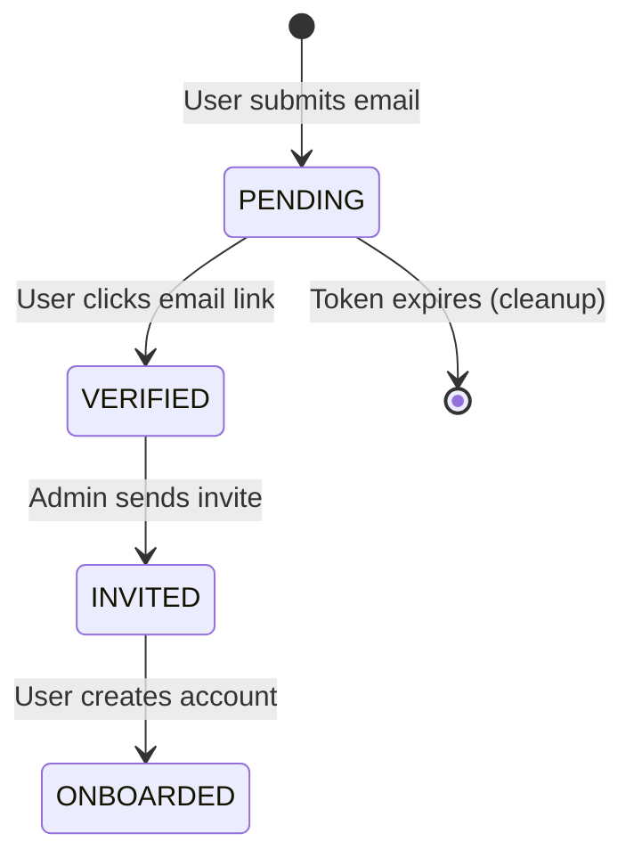

# Data Model: Go, Cart! Rebranding

## Entities

### WaitlistEntry
Represents a user who has signed up for early access.

| Field | Type | Required | Constraints | Description |
|-------|------|----------|-------------|-------------|
| `id` | UUID | Yes | PK | Unique identifier |
| `email` | String | Yes | Unique, Email Format | User's email address |
| `status` | Enum | Yes | `PENDING`, `VERIFIED`, `INVITED`, `ONBOARDED` | Current state of the user |
| `verification_token` | String | No | | Token for email verification |
| `created_at` | DateTime | Yes | | Timestamp of signup |
| `verified_at` | DateTime | No | | Timestamp of email verification |
| `invited_at` | DateTime | No | | Timestamp when invitation was sent |
| `metadata` | JSON | No | | Marketing attribution (source, campaign) |

### ThemePreference (Client-Side Only)
Stores the user's preferred theme.

| Field | Type | Required | Constraints | Description |
|-------|------|----------|-------------|-------------|
| `theme` | Enum | Yes | `light`, `dark`, `system` | User's selected theme |

## Relationships

- **WaitlistEntry** is a standalone entity initially.
- Upon onboarding, a **WaitlistEntry** may be promoted to a **User** (existing entity).

## State Transitions (WaitlistEntry)

## Validation Rules

1. **Email**: Must be a valid email format.
2. **Uniqueness**: Email must not already exist in `WaitlistEntry` or `User` tables.
3. **Rate Limiting**: Max 5 signups per IP per hour to prevent spam.
